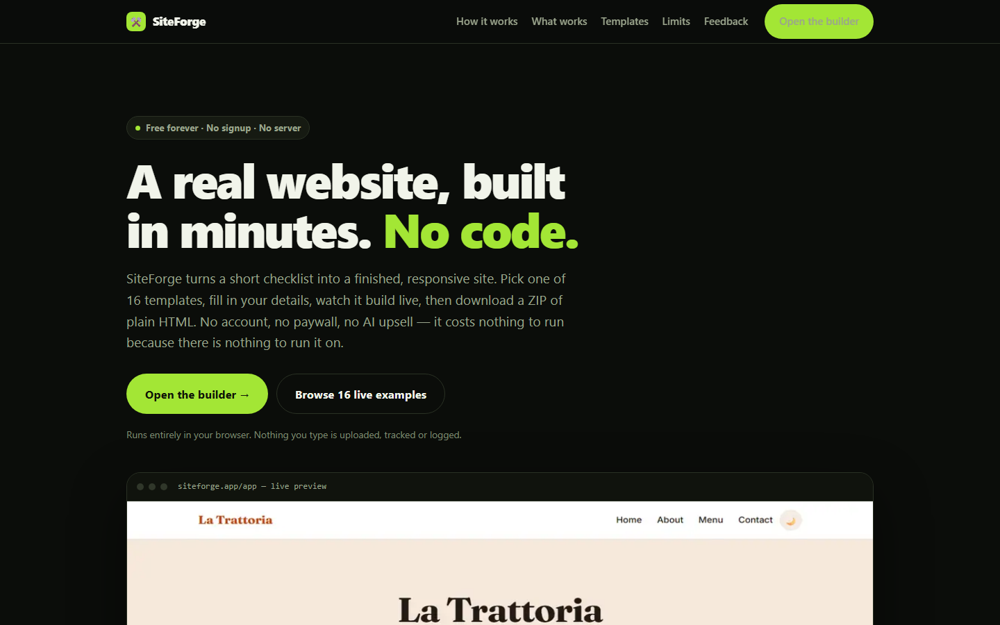
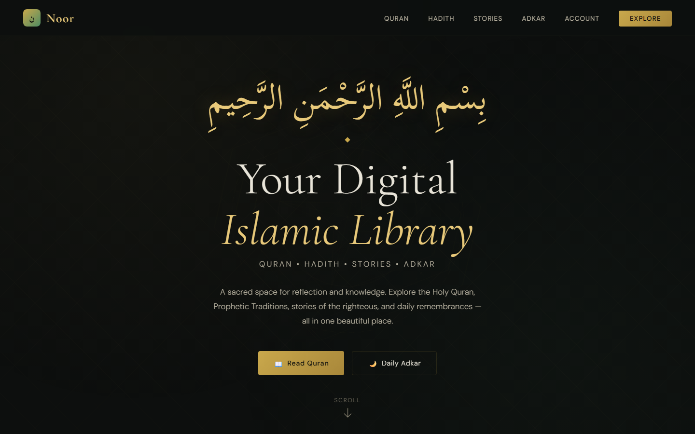
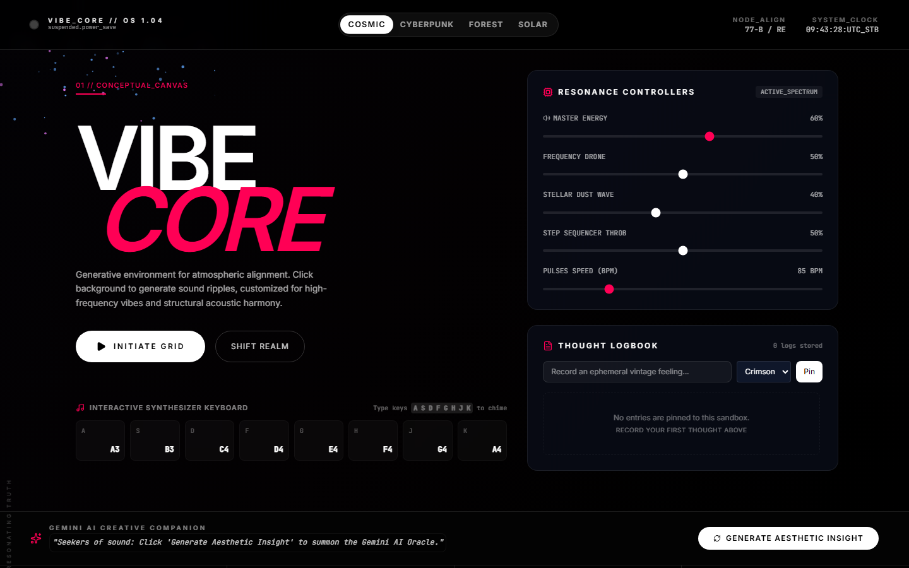
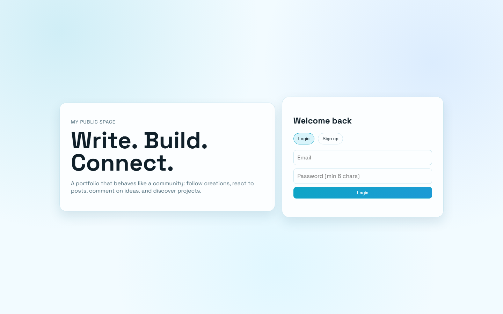
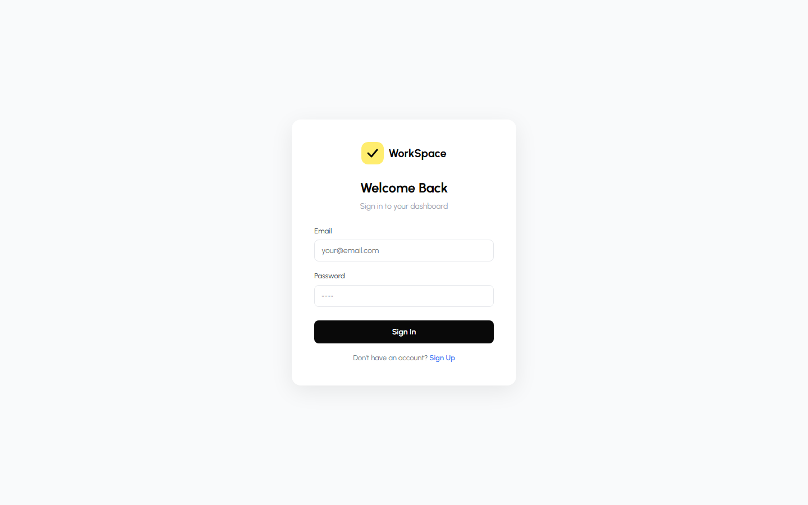
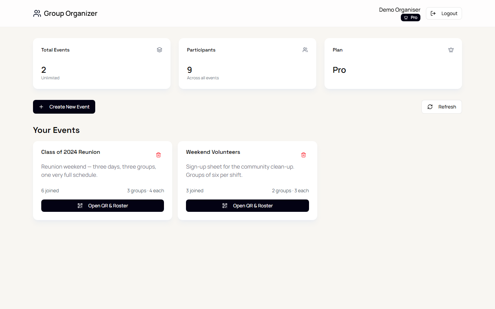

<div align="center">

# hey there 👋


### `muraa-p`

**The handle is a mystery. The projects are not.**


</div>

<br>

<div align="center">

[](https://github.com/muraa-p)
[](https://github.com/muraa-p)

</div>

---

## 🧠 so, who is this person?

Honestly? A **problem-obsessed tinkerer** from Somalia who likes taking things apart and putting them back together — usually in software.

I don't have a five-year plan. What I do have is a habit of noticing something annoying, deciding it *shouldn't be annoying*, and then building the thing that fixes it. Some of them turn into products. Some of them stay rough around the edges. All of them are mine.

**The honest part:** I work with AI coding agents as my implementation layer. I decide what gets built, break it when it's wrong, and own the result. I'd rather tell you that up front than have you find out from my commit history.

```
the part that matters  ->  was the problem real?  does it actually work?
the part that doesn't  ->  who typed the code
```

## 👨‍👩‍👧 meet the children

<div align="center">

### <a href="https://siteforge-indol-xi.vercel.app">SiteForge</a> — *the confident one*


**A website, built in minutes. No code.** A short checklist in, a finished responsive site out. 16 templates, 12 page types, live preview, and you download plain static HTML. No accounts, no backend, no paywall.

[Try it live](https://siteforge-indol-xi.vercel.app) · [Source](https://github.com/muraa-p/siteforge)

</div>

<br>

<div align="center">

### <a href="https://noor-guidance.vercel.app">Noor</a> — *the thoughtful one*


**A digital Islamic library.** Full Qur'an reader, hadith, stories of the righteous, and daily adhkar — in English, Arabic, and Somali. Built to be genuinely useful, not decorative.

[Explore it](https://noor-guidance.vercel.app) · [Source](https://github.com/muraa-p/noor-guidance)

</div>

<br>

<div align="center">

### <a href="https://vibe-sandbox-nine.vercel.app">Vibe Sandbox</a> — *the loud one*


**Make noise, make art, write it down.** A generative playground: an interactive Web Audio synthesizer, a living canvas that reacts to the sound, and a journal for the thoughts that come out of it. Press play and it never sounds the same twice.

[Open it](https://vibe-sandbox-nine.vercel.app) · [Source](https://github.com/muraa-p/vibe-sandbox)

</div>

<br>

<div align="center">

### <a href="https://my-public-space.vercel.app">My Public Space</a> — *the social one*


**Write. Build. Connect.** A portfolio that behaves like a community — follow people, react to posts, comment on ideas, discover what others are making.

[Step inside](https://my-public-space.vercel.app)

</div>

<br>

<div align="center">

### <a href="https://employee-dashboard-gamma-five.vercel.app">WorkSpace</a> — *the busy one*


**The admin side of a small company.** Employees, attendance, leave requests, payroll views, and role-based access. Sign in to see the dashboard.

[Live app](https://employee-dashboard-gamma-five.vercel.app) · [Source](https://github.com/muraa-p/employee-management-dashboard)

</div>

---

<br>

<div align="center">

### <a href="https://organise-us-three.vercel.app/login?demo=1">Group Organizer</a> — *the organised one*


**Split any group into balanced teams, automatically.** Create an event, share a join link or QR code, and participants are sorted into even groups as they sign up. No spreadsheet, no manual reshuffling.

[Try it — no signup needed](https://organise-us-three.vercel.app/login?demo=1) · [Source](https://github.com/muraa-p/organise-us)

<sub>Runs in offline demo mode with seeded sample data, so you can click straight into the dashboard.</sub>

</div>

---

## 🧰 the rest of the family

| Project | What it is | Stack |
|---|---|---|
| **[Beacon](https://github.com/muraa-p/beacon)** | Self-hosted uptime monitoring that publishes a public status page. Zero SaaS bill. | TypeScript, Docker |
| **[Noor Companion](https://github.com/muraa-p/noor-companion)** | Offline-first Qur'an companion for Android — works with zero bars of signal. | Flutter, Dart |
| **[Vibe Sandbox](https://github.com/muraa-p/vibe-sandbox)** | Generative Web Audio soundscapes, canvas art, and mood journaling. | TypeScript |
| **[Warehouse POS](https://github.com/muraa-p/point-of-sale-system)** | Point-of-sale that keeps selling when the internet dies. | Flutter, Supabase |
| **[Group Organizer](https://github.com/muraa-p/organise-us)** · [live demo](https://organise-us-three.vercel.app/login?demo=1) | Groups, join links, and QR codes. Runs offline in demo mode. | TypeScript, Vite |
| **[FocusFlow](https://github.com/muraa-p/focus-flow)** | Pomodoro timer with streaks and local persistence. | JavaScript |
| **[Employee Dashboard](https://github.com/muraa-p/employee-management-dashboard)** · [live](https://employee-dashboard-gamma-five.vercel.app) | Attendance, leave, payroll. | Vite, Supabase |

### Also live right now

| Project | Live demo |
|---|---|
| **Vibe Sandbox** | [vibe-sandbox-nine.vercel.app](https://vibe-sandbox-nine.vercel.app) |
| **FocusFlow** | [focus-flow-liard-delta.vercel.app](https://focus-flow-liard-delta.vercel.app) |
| **Grad Portfolio** | [grad-portfolio-cyan.vercel.app](https://grad-portfolio-cyan.vercel.app) |
| **Group Organizer** | [organise-us-three.vercel.app](https://organise-us-three.vercel.app/login?demo=1) |

## 🍼 currently brewing

> Things in the oven. None of these are ready, and that's the fun part.

- 🔨 **`quran-voice-matcher`** — match a Quranic recitation to its text, word by word
- 🔨 **`scholarmatch`** — scholarship discovery, now open (see above)
- 🔨 **`job portal`** — early sketches, mostly wishful thinking so far
- 🔨 **a few more** — some client work I'll keep quiet about, some experiments that didn't survive

If you like watching things get built, follow along. Sometimes they turn into something real.

Follow along if you like watching things get built. Sometimes they turn into something real.

## 🎨 what I reach for

`TypeScript` `JavaScript` `Dart` `Python` `SQL` `React` `Vite` `Flutter` `Supabase` `PostgreSQL` `Docker` `GitHub Actions` `Linux`

## 🌙 off the clock

<!-- Hobbies below are placeholders — swap in whatever is actually true. -->

- 📖 **Reading** — used to live here. Still like it, but it's been quiet a while and I honestly don't know why. Might be the algorithm eating my attention. Always open to a recommendation.
- 🎧 **Sheikh Abdulrashiid Suufi's recitation** — this one I protect time for.
- 🌸 **Anime** — whatever's good, not whatever's convenient.
- 🔍 **Crime & investigation shows** — the kind where you start guessing, then blame yourself when it turns out you were wrong.
- 🧠 **AI, health, and how they overlap** — the intersection of machine learning, medicine, and mental health is the most interesting thing I can find. This is where most of my thinking happens.

## 📡 find me around the web

<!-- Placeholder links. Replace href values with your real profiles. -->

| | |
|---|---|
| 🐙 **GitHub** | [@muraa-p](https://github.com/muraa-p) |
| 🐦 **[Twitter/X]** | [coming soon](#) |
| 💼 **[LinkedIn]** | [coming soon](#) |
| 🌐 **[Website]** | [coming soon](#) |
| ✉️ **Email** | [coming soon](#) |

## 📬 want to build something?

I like people who have a real problem and a real deadline. If that's you — say hi. Freelance, collab, or just an interesting problem to think about, all fine.

---

<div align="center">

**⭐ if something here helped you, a star costs you one click and means a lot.**

<sub>Built with curiosity, unreasonable amounts of iteration, and substantial help from AI coding agents.</sub>

</div>
